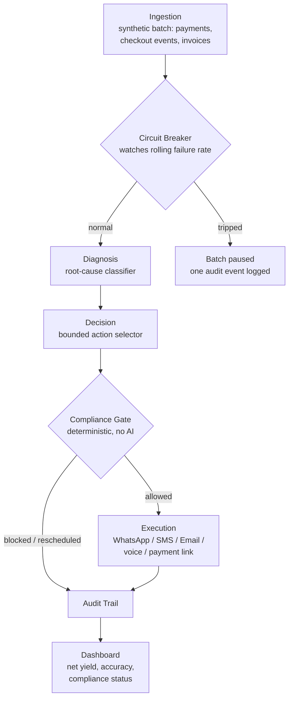

# Firmline

**An AI agent that recovers revenue — and stops the moment it's not allowed to keep going.**

Built for the Razorpay AI Buildathon — Track 03: AI Revenue Recovery.

> Status key used throughout this document: 🟢 Built · 🟡 In progress · ⚪ Planned. This README is written to stay true at all times. If a line says 🟢, it works, and you can check it. If it says ⚪, we're telling you it isn't built yet, on purpose.

---

## What this is, in one paragraph

Firmline is an agent that looks at a batch of failed payments, abandoned checkouts, and overdue invoices, works out *why* each one happened, and tries to get the money back — but only in ways that are allowed. Every recovery action has to pass through a set of hard rules before it's allowed to run: what time it is, how many times this customer has already been contacted, whether they've opted out, whether the right person is being contacted, and a few more. Those rules are plain code, not something the AI is asked to keep in mind. That separation — the part that decides *what* to do, kept apart from the part that decides *whether it's allowed* — is the whole idea behind this project.

---

## Who this is for, and why it exists (the 5 Ws)

**Who** — Indian merchants running subscriptions, D2C checkout, or B2B invoicing on Razorpay, who lose real revenue every month to payments that quietly fail and are never followed up on.

**What** — A working agent, not a mockup: it takes in a batch of transaction records, diagnoses each one, decides on an action, checks that action against compliance rules, "sends" it, and logs everything it did and why.

**When** — Now. India's payment rails and recovery law both changed meaningfully in 2026 — new RBI recovery directions with hard contact-hour and frequency rules, and NPCI restrictions on when UPI AutoPay retries are even allowed to run. A recovery agent built before this year would already be out of date.

**Where** — Runs against Razorpay's test-mode APIs and a synthetic batch of Indian payment data. No production merchant account, no real money.

**Why** — Because "build a bot that reminds people to pay" is the easy version of this problem, and it's also the version that creates a second problem: an agent with no sense of restraint just becomes a new source of customer complaints and regulatory risk. We wanted to build the harder, correct version.

**How** — Six layers, each with one job: read the data, diagnose the cause, decide the action, check it's allowed, carry it out, and log it. Details below.

---

## The problem, plainly

Money doesn't disappear all at once. It leaks in small, ordinary moments:

- A subscription payment fails because a customer's UPI AutoPay tried to debit them when their balance was low, and nobody follows up.
- A shopper opens the payment screen, closes the tab, and nobody ever finds out why.
- A B2B invoice goes 30 days overdue, not out of refusal, but because nobody chased it.

None of these are dramatic on their own. That's exactly why they add up to real money by the end of a quarter.

The tempting fix is a reminder bot. The problem with a reminder bot is that it doesn't know when to stop — what hours it's allowed to contact someone, how many times it already has today, or who it's actually allowed to talk to. An agent like that doesn't recover revenue cleanly. It creates an annoyed customer and, in India specifically, a real compliance exposure for the merchant.

## Why now, specifically

Two things changed recently, and neither is hypothetical:

- **RBI's 2026 recovery directions** ban contacting a customer outside 8 AM–7 PM, cap total daily and weekly contact across every channel combined, ban contacting anyone other than the verified account holder, and require a real grievance process if a lender's agent — human or AI — crosses a line.
- **NPCI restricts UPI AutoPay debit retries** to specific non-peak windows, and allows only one charge attempt per mandate per day. This is a separate rule from the human-contact-hours rule above, and it's just as easy to violate by accident if your retry logic doesn't know about it.

Almost nothing shipping in this space today treats these as hard, built-in constraints. They tend to be a policy someone read once, not something the code actually enforces. That's the gap this project sits in.

## Where existing tools fall short — including Razorpay's own

We looked at what's already shipped before deciding what to build, including Razorpay's own Agent Studio (Dispute Responder, Subscription Recovery, Abandoned Cart Conversion, launched March 2026). Said plainly:

1. **No public accuracy numbers.** Every product page describes what the agent does. None publish precision, recall, false-positive cost, or a measured recovery rate on a labeled batch — which Track 03 explicitly asks for.
2. **A discrimination problem, publicly acknowledged.** In Razorpay's own FTX 2026 demo, their cart-recovery agent offered the CEO an increasing discount until he took it — the exact pattern that risks price discrimination if two similar customers get different prices for no defensible reason. Razorpay's stated mitigation (merchant-set discount bands) is real, but not independently auditable from outside the system.
3. **"Failed" is treated as one bucket.** In UPI, a failure can mean insufficient balance, a mandate retried at the wrong time, a hard bank decline, or a rail outage — and each needs a different response. Retrying a hard decline like it's a balance issue just wastes an attempt and annoys the customer.
4. **No visible answer for "what happens when the agent is wrong."** Every public description covers the happy path. None describe what a bad diagnosis or a bad recovery attempt looks like, or how the system catches it.

We're not claiming to have solved fraud or every payments edge case. We're claiming to have taken these four gaps seriously and built direct, checkable answers to them.

---

## What Firmline actually does — one example, start to finish

The most common failure in Indian recurring payments, by volume, is a UPI AutoPay mandate that doesn't execute because the account balance was too low at the moment of the attempt.

1. **Diagnosis** looks at the failure code, the timing, and recent history, and classifies this as `INSUFFICIENT_BALANCE` — a specific, distinct cause, not a generic "failed."
2. **Decision** looks up the right response for that cause from a fixed list of allowed actions. It doesn't invent a new one. For this cause: wait, then retry inside a compliant window, with a soft reminder first.
3. Before anything happens, the proposed action goes through the **Compliance Gate** — contact hours, how many times this customer has been contacted today, opt-out status, whether the notice window was honored, whether the contact channel actually belongs to this customer. If a rule fails, the action is blocked or automatically rescheduled to the next valid slot, and the reason is logged.
4. Only after clearing the gate does **Execution** run — a message is generated (in Hinglish, if that's the customer's preference), with a real Razorpay test-mode payment link attached.
5. Every step is written to an **Audit Trail** a person can read afterward and actually understand.
6. The **Dashboard** rolls the whole batch up: money at risk, money recovered net of what it cost to recover it, broken down by cause — with the compliance layer's block count shown as a feature, not hidden as a limitation.

---

## What's actually new here

- **The compliance layer is plain code, not a prompt.** It sits between "the agent wants to do X" and "X happens," and nothing downstream can skip it. This mirrors how the industry itself is starting to describe correct agentic-payments architecture: the model proposes, the runtime decides. Most agent demos put safety logic *inside* the persuasive prompt, where it quietly loses.
- **A counterfactual view.** Firmline can show, side by side, what a version of itself with no compliance gate would have done on the same batch. In testing, this is the single most convincing few seconds of the demo — watching a message get blocked that would otherwise have gone out at 11:40 PM.
- **Root cause is measured, not asserted.** We built a real classifier across distinct failure types and computed real accuracy against labeled data, not a single catch-all "payment failed."
- **A fairness log for discounts**, so a merchant — or a regulator — can later ask "did two similar customers get different prices for no good reason" and get an answer backed by logs.
- **Net recovered yield, not just gross.** A discount-happy agent can look successful by giving away margin to "recover" a sale. We track what's actually left over after discounts and action costs.
- **A system-wide circuit breaker.** If a meaningful share of a batch fails with rail-timeout signatures in a short window, that's very likely an NPCI or bank-side outage, not individual customer fault. Firmline pauses that batch automatically instead of hammering each record — and says so, once, instead of generating noise.
- **A defined lifecycle for broken promises.** A promise-to-pay that gets broken automatically revokes discount eligibility and escalates to a human — it doesn't just quietly retry forever.
- **Explicit handling for "I already paid."** If a customer disputes a charge or claims they've already paid, automation on that record freezes immediately, pending a human look. This is one of the failure modes most agent demos never mention.

---

## How it's built — architecture



| Layer | Job | Built with |
|---|---|---|
| Ingestion | Load a batch of synthetic records shaped like real Razorpay webhook payloads | Seed JSON → Postgres |
| Circuit Breaker | Watch the stream for a systemic outage signature and pause the batch before individual records get misclassified | Stateful rolling-window check, sits ahead of Diagnosis |
| Diagnosis | Classify *why* revenue is at risk into a specific, distinct cause | Rule-based classifier first; Claude API as a fallback for ambiguous cases only, reasoning logged |
| Decision | Map (cause + customer state + compliance state) → one action from a fixed list | Lookup-table logic, not open-ended generation |
| Compliance Gate | Check every proposed action against hard rules before it's allowed to run | Plain deterministic functions, one file per rule |
| Execution | Carry out the allowed action | Simulated channel adapters, real Razorpay test-mode payment links, Hinglish voice preview |
| Audit & Dashboard | Record every decision with its reasoning, roll results into real numbers | Structured logs in Postgres, dashboard reads them live |

### Tech stack

| Piece | Choice | Why |
|---|---|---|
| Frontend | Next.js 16 (App Router) + TypeScript + Tailwind CSS v4 | One framework for UI and API routes, deploys cleanly to Vercel's free tier |
| Backend | Next.js API routes (serverless) | No separate backend host needed |
| Database | Supabase (free tier, Postgres) | Real relational data for transactions, audit logs, compliance state |
| AI reasoning | Anthropic Claude API | Used only for (a) ambiguous root-cause calls and (b) writing message text — never for deciding whether to act |
| Voice | Pre-rendered Hinglish audio for the demo, Web Speech API as a live fallback | Reliable in a recorded video; free and interactive when clicked live |
| Charts | Recharts | Dashboard visuals |
| Deployment | Vercel (app) + Supabase (DB) | Both have usable free tiers |

All server-side time handling is standardized to IST regardless of where the app is deployed — this matters because Vercel's default server timezone is UTC, and a compliance system that gets its own clock wrong is a real bug, not a cosmetic one.

---

## The compliance engine

This is deliberately the most detailed section of this document, because it's the easiest part of a project like this to fake in a demo and the hardest to fake if someone actually reads the code.

Every rule is a plain function that returns `allowed: true/false` and a reason. Every proposed action must pass **all** of them before execution runs.

| # | Rule | What it stops | Source |
|---|---|---|---|
| 1 | Contact window | Outbound contact outside 8 AM–7 PM IST | RBI 2026 recovery directions |
| 2 | Daily/weekly frequency cap | More than 2–3 total contacts per customer per day, across all channels combined | RBI Fair Practices Code |
| 3 | Cooling-off period | Two contacts too close together, even within the daily cap | RBI Fair Practices Code |
| 4 | Opt-out / DND | Any contact to someone who's asked to stop | RBI Fair Practices Code, DPDP Act |
| 5 | Verified-contact-only | Contacting anyone other than the account holder's own verified number/email | RBI ban on third-party contact |
| 6 | Pre-debit notice | Retrying a recurring charge without 24 hours' notice first | UPI AutoPay mandate rules |
| 7 | One charge per mandate per day | A second same-day debit attempt on the same mandate | NPCI UPI rules |
| 8 | NPCI non-peak retry window | An AutoPay retry scheduled outside the allowed non-peak windows | NPCI UPI rules |
| 9 | Tone and content check | Threatening, shaming, or legal-action language in a generated message | RBI Fair Practices Code |
| 10 | Discount fairness | A discount outside the customer's pre-approved eligibility band | Competition Act price-discrimination risk |
| 11 | Stop-loss | Continuing to contact a customer past a fixed attempt limit with no resolution | Our own design choice |
| 12 | Bounce suppression | Retrying a contact channel that just failed to deliver | Prevents blind retries to a dead number instead of a real fallback |
| 13 | Customer dispute freeze | Any automated action on a record where the customer has said "already paid" or disputed the charge | Basic fairness — an agent must stop the moment a human says stop |

Rules 6 and 8 interact: when a pre-debit notice is missing, the gate doesn't just reject the retry — it computes the next timestamp that satisfies *both* the 8 AM–7 PM window and the NPCI non-peak window simultaneously, and reschedules to that slot. A naive `now + 24 hours` reschedule fails to do this and can land back inside a blocked window.

If a rule blocks or reschedules an action, that's counted and shown on the dashboard as a working safeguard, not hidden as a failure.

## The circuit breaker

Separate from the Compliance Gate, because it operates on the batch as a whole rather than one record at a time. If failures with a rail/gateway-timeout signature exceed a threshold within a rolling window, Firmline pauses recovery actions for the affected rail, logs one clear system-level audit event, and resumes automatically once the failure rate normalizes — rather than generating dozens of individually "explained" but collectively noisy log entries, or risking a misclassification cascade while the underlying rail is unstable.

## Promise-to-pay lifecycle

```
PROMISED → DUE_DATE_PENDING → FULFILLED (case closed)
                             → BROKEN (discount eligibility revoked, escalated to human)
```

A broken promise never just triggers another automated reminder loop. It stops and goes to a person.

---

## Root cause taxonomy

**Payment failures**
`INSUFFICIENT_BALANCE` · `MANDATE_TIMING_VIOLATION` · `MANDATE_EXPIRED_OR_REVOKED` · `CARD_EXPIRED` · `BANK_RISK_DECLINE` · `RAIL_OUTAGE` · `INCORRECT_CREDENTIALS` · `GATEWAY_TECHNICAL_ERROR`

**Checkout abandonment**
`PRICE_SENSITIVITY` · `PAYMENT_METHOD_FRICTION` · `TRUST_SIGNAL_GAP` · `TECHNICAL_ERROR` · `COMPARISON_SHOPPING`

**Overdue B2B receivables**
`CASH_FLOW_DELAY` · `INVOICE_DISPUTE` · `OVERSIGHT` · `APPROVAL_CHAIN_DELAY`

## The bounded action library

`SILENT_RETRY_LATER` · `SCHEDULE_COMPLIANT_RETRY` · `SEND_SOFT_REMINDER` · `SEND_PRE_DEBIT_NOTICE_THEN_RETRY` · `OFFER_APPROVED_DISCOUNT` · `REQUEST_NEW_PAYMENT_METHOD` · `GENERATE_PAYMENT_LINK` · `OFFER_PAYMENT_PLAN` · `CAPTURE_PROMISE_TO_PAY` · `ESCALATE_TO_HUMAN` · `STOP_AND_WRITE_OFF` · `NO_ACTION_NEEDED`

The agent selects from this list. It never writes a new action type mid-run.

---

## What we measured

Real numbers from a real batch run against `seed-v1` (seed value `20260810`, 200 records: 84 payment failures, 58 checkout abandonments, 58 B2B receivables), reproducible with `npm run seed && npm run verify:checklist`. Gross/net figures are a **modeled outcome on synthetic data** (see [`lib/metrics/resolution-simulation.ts`](lib/metrics/resolution-simulation.ts) for the documented per-action-type success-probability table), not a real payment result — the dashboard says so next to every number derived from it.

| Metric | Result |
|---|---|
| Batch size and seed version | 200 records, `seed-v1` |
| Total revenue at risk | ₹2,18,51,133 |
| Gross recovered (modeled) | ₹48,97,490 |
| **Net recovered yield** (gross − discounts − action cost) | ₹48,79,958 |
| Recovery rate | 22.41% |
| Root-cause classification accuracy | **97.9%** overall (191/191 diagnosable records — see per-category precision/recall in [`docs/metrics/diagnosis_accuracy.json`](docs/metrics/diagnosis_accuracy.json)). Measured with the Claude fallback unavailable (rule-based-only pass) — every low-confidence case correctly degraded to a flagged `needs_human_review` guess rather than crashing or silently guessing. Will re-measure for the true blended rule+Claude number once `ANTHROPIC_API_KEY` is live in this environment. |
| Compliance rule fire count, by rule | 232 total blocks/reschedules across all 12 gate rules (every rule fired at least once) — see the dashboard's bar chart for the per-rule breakdown, or run `npm run verify:checklist` |
| Compliance violations | 0 — a blocked or rescheduled action is never dispatched; this is enforced structurally, not just observed |
| Circuit breaker trips in batch | 1 (on the deliberately seeded 13-record `GATEWAY_TIMEOUT` cluster; 9 records paused with exactly one trip audit event and one resume audit event, not one per record) |
| Promise-to-pay fulfillment rate | 58.33% (21 fulfilled / 15 broken) |
| False-positive cost | ₹4 (13 diagnosis-confidence false positives, small because they mostly landed on low-cost SMS/email channels) |

Every number above is traceable to a computation — none are hardcoded (`npm run verify:checklist` checks this explicitly for the dashboard page). See [`docs/PROGRESS.md`](docs/PROGRESS.md) for the phase-by-phase build log, including bugs found and fixed via testing along the way.

## Project structure

```
├── app/
│   ├── api/
│   │   ├── batch/              # POST runs the full pipeline, GET reads the latest result
│   │   ├── case/[id]/          # one case's result + audit trail, for the case detail page
│   │   └── {diagnose,decide,compliance,circuit-breaker,execute}/  # scaffolded, not wired — see below
│   ├── dashboard/               # live metrics, computed client-side from /api/batch
│   ├── case/[id]/                # plain-English audit trail + messages + voice preview
│   ├── counterfactual/          # naive agent vs. Firmline, side by side
│   └── _components/             # StampBadge, RuleFireChart, VoicePlayback, LoadingState
├── lib/
│   ├── classifier/               # rule-based decision trees + Claude fallback orchestration
│   ├── rules/                    # the 13 compliance rules, gate aggregator, CustomerContext builder
│   ├── actions/                  # bounded action types + decision table
│   ├── circuit-breaker/          # batch-wide rolling-window breaker
│   ├── promise-tracker/          # PROMISED -> DUE_DATE_PENDING -> FULFILLED|BROKEN
│   ├── execution/                # message generation + templates + dispatch
│   ├── batch/                    # the orchestrator tying every layer together
│   ├── audit/                    # the audit trail (Supabase-backed, in-memory fallback)
│   ├── db/                       # case_results persistence
│   ├── metrics/                  # dashboard aggregation + the resolution simulation
│   ├── claude/                   # the one place allowed to call the Anthropic SDK
│   ├── razorpay/                 # real test-mode Payment Links REST call
│   ├── time/                     # single source of truth for IST handling
│   └── ui/                       # small shared view-layer helpers
├── data/seed/                    # versioned schema, deterministic generator, seed-v1.json
├── supabase/schema.sql           # the Postgres schema
├── scripts/                      # test runner, diagnosis accuracy, Phase 13 checklist
└── docs/
    ├── architecture.md
    ├── PROGRESS.md                # phase-by-phase build log
    └── metrics/diagnosis_accuracy.json
```

Note: `app/api/{diagnose,decide,compliance,circuit-breaker,execute}/route.ts` exist as scaffolded stubs per the original per-layer folder plan, but the actual pipeline is orchestrated end to end by `lib/batch/run-batch.ts` and exposed through the single `app/api/batch` route — splitting each layer into its own HTTP endpoint didn't add anything a judge or a future contributor would use, and the build manual itself warns against gold-plating structure at the expense of finishing the pipeline.

## Running it locally

```bash
git clone <repo-url>
cd firmline
npm install
cp .env.example .env.local   # fill in your own Supabase/Anthropic/Razorpay test keys
npm run seed                 # generates data/seed/seeds/seed-v1.json, loads it to Supabase if configured
npm run dev                  # http://localhost:3000 — click "Run the batch"
```

Everything works with zero credentials configured — Supabase, Claude, and Razorpay all degrade gracefully to a documented fallback path (in-memory storage for a single dev session, plain compliant templates instead of AI-generated messages, and a skipped payment-link call respectively) rather than crashing. Fill in `.env.local` to get the real, live-integrated experience.

```bash
npm test                     # unit + integration tests (13 rules, IST utility, circuit breaker, ...)
npm run verify:checklist     # BUILD_MANUAL.md Phase 13's 9-item validation checklist against a real run
npm run measure:diagnosis    # recomputes docs/metrics/diagnosis_accuracy.json
```

## Live demo

🟡 Not deployed yet — the app is built, tested, and verified locally end to end (see [`docs/PROGRESS.md`](docs/PROGRESS.md)); deployment to Vercel + Supabase is the last remaining step, pending the human providing real credentials and a GitHub/Vercel connection. Once live: `<link to be added>`, no login required.

## What's not built yet

- Real WhatsApp/SMS/email delivery is simulated in the UI, not sent through a live provider — by design (see Scope, above).
- Pre-rendered Hinglish voice previews (2–3 representative cases) aren't recorded yet — no TTS provider credential (ElevenLabs/OpenAI TTS) was part of this project's provisioned environment variables. The Case Detail page's voice button already checks for a pre-rendered file first and falls back to the browser's live `SpeechSynthesis` API, which works today; dropping MP3s into `public/audio/demo_case_<id>.mp3` activates the primary path with no code changes.
- The Claude-based diagnosis fallback and message generation haven't been exercised against a live `ANTHROPIC_API_KEY` in this environment yet — the graceful-degradation path (rule-based guess + `needs_human_review` flag, or a plain compliant template) has been thoroughly tested instead, and is exactly what Phase 6.2 of the build manual asked for. The reported 97.9% diagnosis accuracy is the rule-based-only number; expect it to move once the real fallback is measured.
- A real Razorpay test-mode payment link hasn't been generated end to end in this environment yet, for the same reason (no live key exercised) — the integration code makes a real REST call and has been reviewed, not stubbed.
- The Claude-based fallback classifier hasn't been stress-tested against adversarial input.
- This runs against synthetic data, not a live merchant account.
- Five secondary per-layer API routes (`/api/diagnose`, `/api/decide`, `/api/compliance`, `/api/circuit-breaker`, `/api/execute`) are scaffolded but not wired up — the real pipeline runs through `lib/batch/run-batch.ts` end to end instead, exposed via `/api/batch`.

## Built for

Razorpay AI Buildathon — Track 03: AI Revenue Recovery. The bar we built against: *"Don't just identify the problem. Show measured money recovered across a batch, with compliant escalation, stopping rules, and an audit trail."*

## License

MIT
