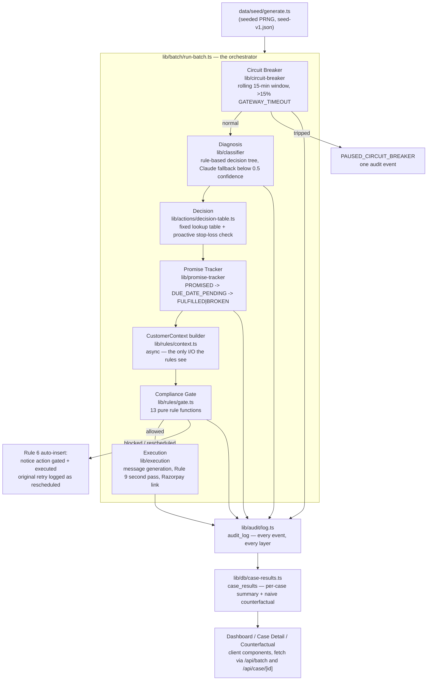

# Firmline — Architecture

This document restates the README's architecture section in technical depth: the actual data flow, the actual schema, the actual rule specifications, and what was deliberately left out of scope and why. It reflects the code as built, not as originally planned — see [`PROGRESS.md`](PROGRESS.md) for the phase-by-phase log of what changed along the way and why.

## Data flow

**Why a batch orchestrator, not per-layer API routes.** The original folder plan sketched a separate route per layer (`/api/diagnose`, `/api/decide`, ...). Those stub files still exist, but the real pipeline is a single function, `runBatchPipeline`, called once by `POST /api/batch`. Splitting it into HTTP hops between layers would have added latency and complexity without adding anything a judge or future contributor could actually use — every layer is already independently unit-tested (`lib/classifier/*.test.ts`-style coverage via `lib/rules/rules.test.ts`, `lib/circuit-breaker/index.test.ts`, etc.), so the boundary that matters for testability is the module boundary, not the HTTP boundary.

**Why rules are pure functions and context-building is async and separate.** BUILD_MANUAL.md is explicit that every compliance rule is `(action, context) => RuleResult` — no I/O. `lib/rules/context.ts` is where the async work happens: it queries the audit log (real prior events plus a documented backfill of the record's own seed baseline — see "The backfill policy" below) once, before any rule runs, and hands the 13 rule functions a fully-formed `CustomerContext`. This keeps the rules trivially testable (`lib/rules/test-fixtures.ts` builds a compliant baseline action/context pair in one line) and keeps `gate.ts` — the one place that decides "allowed or not" — free of any database logic.

## Schema

### Seed data (`data/seed/schema.ts`, locked, `SEED_SCHEMA_VERSION = 1`)

Three record types — `PaymentFailure`, `CheckoutAbandonment`, `B2BReceivable` — each carrying its own `true_root_cause` ground-truth label (never passed to the classifier, only used for scoring). See the file itself for the full field list; it's copied verbatim from the build manual and has not changed since Phase 2.

### Postgres (`supabase/schema.sql`)

- `payment_failures`, `checkout_abandonments`, `b2b_receivables` — the seed data, loaded by `npm run seed`.
- `audit_log` — every event from every layer: `{ id, case_id, customer_id, mandate_id, channel, timestamp, layer, event_type, detail_json, reasoning_text }`. Indexed on `case_id`, `customer_id`, `event_type`, `layer`. This is the single source of truth the Case Detail page reads to build its plain-English timeline, and what the dashboard's rule-fire-count and circuit-breaker/promise-tracker metrics are computed from.
- `case_results` — one row per case per batch run: the diagnosis, the real (gated) action outcomes, and the naive-counterfactual action summary, as JSONB. Cleared and rewritten on every batch run — it represents *the latest run*, not an unbounded history, the same way a real production dashboard would show "this run's numbers," not a lifetime total.

**Row Level Security is deliberately off.** This is a single, public, no-login demo instance over synthetic data (BUILD_MANUAL.md section 2: "No login system, no multi-tenant accounts, no billing"). There is no per-user data to isolate, so RLS would add complexity without adding safety. A real multi-tenant version of Firmline would need it from day one.

### In-memory fallback and its limits

Every persistence-touching module (`lib/audit/log.ts`, `lib/db/case-results.ts`, `lib/supabase/client.ts`) falls back to an in-process store when Supabase env vars aren't configured, so `npm run dev` works fully offline. This fallback has a real, discovered limit: **Next.js gives Route Handlers and page Server Components separate module instances**, even within the same dev process. A module-level variable written by `POST /api/batch` was invisible to `app/dashboard/page.tsx` when the page directly imported the same "shared" store — caught by actually clicking through the app in a browser, not by unit tests, which don't cross that boundary. The fix: every page that reads batch results does so via a real HTTP fetch to `/api/batch` or `/api/case/[id]` (client components, mirroring how the batch-view page already worked), never via a direct server-side import of the store. This also means the app behaves correctly in Vercel's stateless serverless model without any special-casing — the in-memory path was only ever a local-dev convenience, and now it's a *correct* one.

## The 13 compliance rules, precisely

Each rule lives in its own file (`lib/rules/01-contact-window.ts` … `13-dispute-freeze.ts`), exports a `ComplianceRule` (`(action, context) => RuleResult`) and its own `testCases: RuleTestCase[]` array, run through the shared `runRuleTestCases` harness in `lib/rules/rules.test.ts`.

| # | Rule | Applies to | Notable implementation detail |
|---|---|---|---|
| 1 | Contact window | every action with a contact target | `[08:00, 19:00)` IST — open-inclusive, close-exclusive, tested at both boundaries |
| 2 | Frequency cap | every action | 2/24h, 5/7d, counted from real `contact_attempt` audit events (including backfilled baseline) |
| 3 | Cooling-off | every action | last contact < 4h blocks regardless of the daily cap; boundary at exactly 4h is allowed |
| 4 | Opt-out | every action | fast-path, checked first by the gate, short-circuits everything else |
| 5 | Verified contact | every action with a contact target | exact match against `verifiedPhone`/`verifiedEmail`; a small deterministic demo subset (`id % 17 === 4`) gets a mismatched target so this rule has real content to catch |
| 6 | Pre-debit notice | `SCHEDULE_COMPLIANT_RETRY` only | missing notice → `rescheduleTo = nextValidComplianceSlot(proposedAt + 24h, isAutoPayRetry=true)`, never a raw `+24h`; the orchestrator auto-inserts a `SEND_PRE_DEBIT_NOTICE_THEN_RETRY` action, gated independently |
| 7 | One charge per mandate per day | `SCHEDULE_COMPLIANT_RETRY` only | IST calendar-day match on `charge_attempt` events for that `mandate_id` |
| 8 | NPCI non-peak window | `SCHEDULE_COMPLIANT_RETRY` only | `[00:00,10:00) ∪ [13:00,17:00) ∪ [21:30,24:00)` IST |
| 9 | Tone/content | generated message text (not action+context — a deliberately different signature, called a second time by `lib/execution/message.ts` after generation) | threat/shaming pattern lists, multiple exclamation marks, a 5+ letter all-caps run (long enough to skip real acronyms like UPI/RBI/IST) |
| 10 | Discount fairness | `OFFER_APPROVED_DISCOUNT` | three segment bands; a small deterministic demo subset (`id % 11 === 3`) deliberately overreaches by +20 points so this rule has content to catch |
| 11 | Stop-loss | every action | `previousAttemptsTotal21d >= 5`; the Decision layer also proactively avoids proposing a retry it already knows this will block |
| 12 | Bounce suppression | every action | `lastContactStatus === "FAILED_INVALID_NUMBER"` blocks outright — no alternate-channel attempt, ever |
| 13 | Dispute freeze | every action | fast-path, checked second (right after opt-out), short-circuits everything else |

**Why 6/7/8 apply only to `SCHEDULE_COMPLIANT_RETRY`, not to the auto-inserted notice.** An earlier version scoped these to "any mandate-retry-shaped action," which included the notice action Rule 6 itself inserts — meaning the notice needed a notice before it could be sent, an infinite regress. It also meant Rule 8's NPCI-peak-window restriction (which exists to govern *debit timing*) was being applied to a plain informational message that isn't a debit attempt at all. Narrowing the applicability list to just the actual charge-attempt action type fixed both problems at once.

## Two real bugs worth naming (found by testing, not assumed away)

1. **The seed-baseline backfill originally collided two independent rules.** `previous_attempts_today` was backfilled as synthetic audit events spaced 1 hour apart from the proposed action time — which meant almost every record with *any* same-day history also fell inside Rule 3's 4-hour cooling-off window, making Rules 2 and 3 fire together on ~60% of the batch instead of catching genuinely distinct violations. Widened to 5-hour spacing.
2. **B2B actions used real wall-clock time as their proposed contact time**, because `B2BReceivable` has no per-record timestamp field the way `PaymentFailure`/`CheckoutAbandonment` do. Running the batch at 7:45 PM IST made every single B2B action fail Rule 1 for that reason alone — an outcome that depended on what time of day someone happened to click "Run the batch," which is the opposite of the reproducibility this whole system is built on. Fixed with a fixed IST anchor time as the default.

Both were caught by actually running the app in a browser and reading the result, not by unit tests alone — unit tests validated each piece in isolation; only an end-to-end run against real seed data surfaced how the pieces interacted.

## What was deliberately left out of scope, and why

- **No real outbound messages.** Every channel except Razorpay's payment-links API is simulated. This is the build manual's own scope line, and it's the right one: a hackathon demo does not need to actually text 200 synthetic phone numbers to prove the compliance logic works, and doing so would risk hitting real numbers if the "synthetic" data ever overlapped a real one by chance.
- **No login, no multi-tenancy.** A single public demo instance is sufficient to prove the architecture; adding auth would be pure overhead for a judged buildathon submission and would directly work against the "no login required" requirement in the judging criteria.
- **No fraud detection, no chargeback handling.** That's a different problem (and a different track) from revenue recovery. Firmline's dispute-freeze rule (13) stops the moment a customer disputes a charge — it hands off to a human rather than trying to also adjudicate the dispute itself.
- **Five per-layer API routes are scaffolded but not wired.** See "Why a batch orchestrator" above.
- **Pre-rendered Hinglish voice files aren't recorded.** No TTS provider credential was among the five environment variables this project was provisioned with. The fallback path (live browser `SpeechSynthesis`) was always meant to be a legitimate secondary path, not a placeholder — it works today.
- **Claude fallback and Razorpay integration are implemented but not yet exercised against live credentials in this environment.** Both have a fully tested graceful-degradation path exercised extensively instead (see `docs/PROGRESS.md`), which is arguably the more important thing to have proven for a system whose core thesis is "handle failure gracefully."
